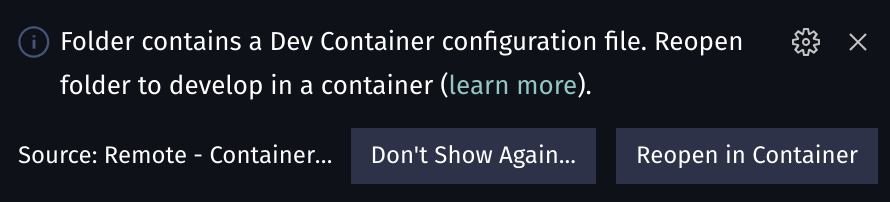

# Azure Container Apps

Container Apps is a new serverless offering from Azure. As of the time when this article is published, it is still in preview. 

The reason this offering is interesting is that it fills the gap between serverless and full blown Kubernetes setup. Traditionally for microservice type workloads one would use either serverless or Kubernetes.

This was not ideal as serverless is more suitable for event driven architectures, whereas Kubernetes is complex and requires specialized knowledge to run production grade workloads.

> Microservices architecture moves complexity from inside of a program to surrounding infrastructure.

Another solution  
### Explain DAPR briefly

### Diagram with component architecture
### Sequence diagram with revision flow

## Demo Scenarios

If you want to practice along, I've created [a repo with devcontainer setup](https://github.com/Piotr1215/azure-container-apps) covering 2 separate scenarios.
The first scenario located in folder `1.Hello-World` will deploy a sample "hello world" web app and expose entpoint as internal ingress.
Second scenario uses [bicep](https://docs.microsoft.com/EN-US/azure/azure-resource-manager/bicep/) to deploy additional configuration and showcase usage of secrets in contianer app.

### Prerequisites

There are a few prerequisites:

- VS Code
- Azure subscription
- Docker host running on your machine

1. Clone the repository: https://github.com/Piotr1215/azure-container-apps 
2. VS Code should prompt you to reopen the repo in devcontainer



If the prompt does not appear, you can use <kbd>F1</kbd> or <kbd>Ctrl+Shift+P</kbd> and select *Reopen in Container*.

You need to perform [az login](https://docs.microsoft.com/en-us/cli/azure/authenticate-azure-cli). By default, az login command will open up a browser to securely authenticate with Azure subscription.

### Hello World

To start with the example, navigate to the `1.Hello-World` directory and run `setup.sh`.

You will be prompted to provide a few variables for the script. Default values are pre-populated. If you want to use the default values, just hit <kbd>enter</kbd>.

> At this point the Container Apps service is available only in the *northeurope* and *canadacentral* regions.


The script will perform following actions:

- install container apps az extension
- create a resource group
- create a container app environment
- create a container app
- deploy a hello world contianer to the container app
- expose url where you can check the web app live
- provide instructions to clean up resources

Once the script finishes, a URL with the running web app will be displayed as well as a command to delete the environment afterwards.


The URL should show a running hello world app:


Container Apps integrate fully with Azure Monitor observability. Navigate to Azure Portal and find the resource group

> If you have accepted the default values it will be *rg-app-container-test*

From there we can execute a simple query to read the stdin logs from sample app:


```sql
ContainerAppConsoleLogs_CL 
| where ContainerAppName_s == 'my-container-app'
| project ContainerAppName_s, ContainerImage_s, format_datetime(TimeGenerated, "hh:mm:ss"), RevisionName_s, EnvironmentName_s, Log_s
```

### State Store with Bicep

To start with the example, navigate to the `2.Bicep-Deploy` directory and run `setup.sh`.

> Bicep is out of scope for this article, but if you are interested, it's worth poining out that together with az CLI, it creates a nice combination of *imperative* and *declarative* style of IaC
