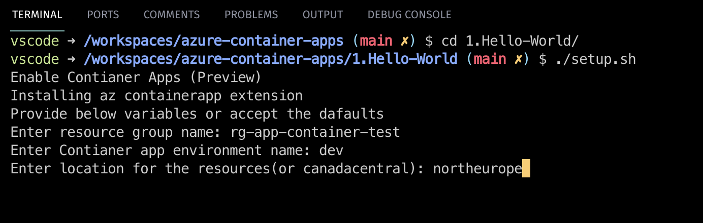
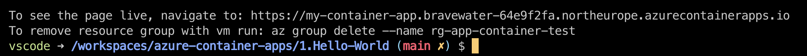
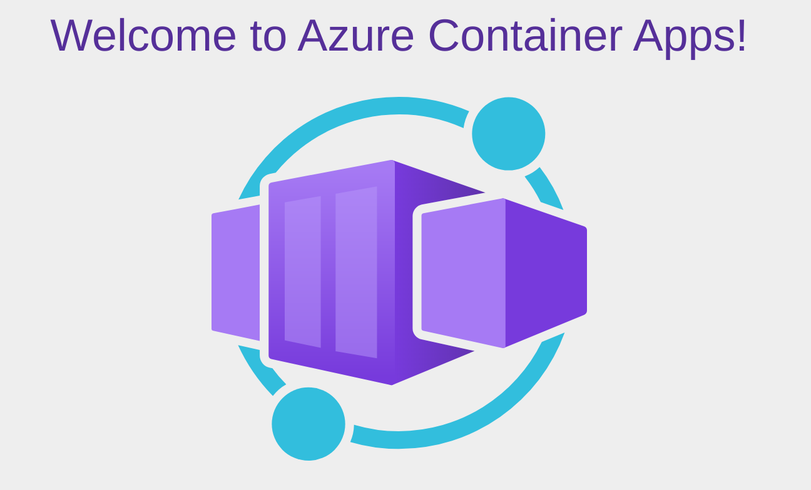
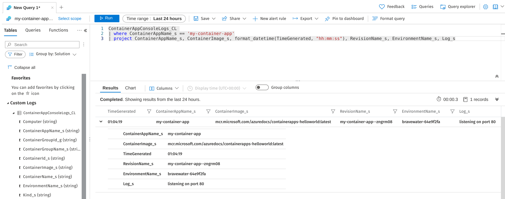

# Azure Container Apps

Container Apps is a new serverless offering from Azure.

### Compare other offerings
### Explain DAPR briefly
### Diagram with component architecture
### Sequence diagram with revision flow

## Demo Scenarios

If you want to practice along, I've created [a repo with devcontainer setup](https://github.com/Piotr1215/azure-container-apps) covering 3 separate scenarios.

There are a few prerequisites:

- VS Code
- Azure subscription
- Docker host running on your machine

1. Clone the repository: https://github.com/Piotr1215/azure-container-apps 
2. VS Code should prompt you to reopen the repo in devcontainer

You need to perform [az login](https://docs.microsoft.com/en-us/cli/azure/authenticate-azure-cli). By default, az login command will open up a browser to securely authenticate with Azure subscription.

### Hello World

To start with the example, navigate to the `1.Hello-World` directory and run `setup.sh`.

You will be prompted to provide a few variables for the script. Default values are pre-populated. If you want to use the default values, just hit <kbd>enter</kbd>.

> At this point the Container Apps service is available only in the *northeurope* and *canadacentral* regions.



The script will perform following actions:

- install container apps az extension
- create a resource group
- create a container app environment
- create a container app
- deploy a hello world contianer to the container app
- expose url where you can check the web app live
- provide instructions to clean up resources

Once the script finishes, a URL with the running web app will be displayed as well as a command to delete the environment afterwards.



The URL should show a running hello world app:



Container Apps integrate fully with Azure Monitor observability. Navigate to Azure Portal and find the resource group

> If you have accepted the default values it will be *rg-app-container-test*

From there we can execute a simple query to read the stdin logs from sample app:



```kusto
ContainerAppConsoleLogs_CL 
| where ContainerAppName_s == 'my-container-app'
| project ContainerAppName_s, ContainerImage_s, format_datetime(TimeGenerated, "hh:mm:ss"), RevisionName_s, EnvironmentName_s, Log_s
```

### State Store with Bicep

### Introduction to DAPR

